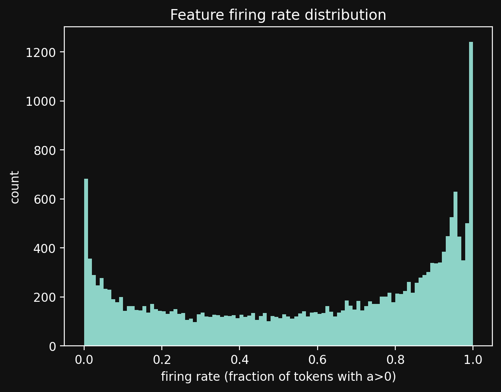
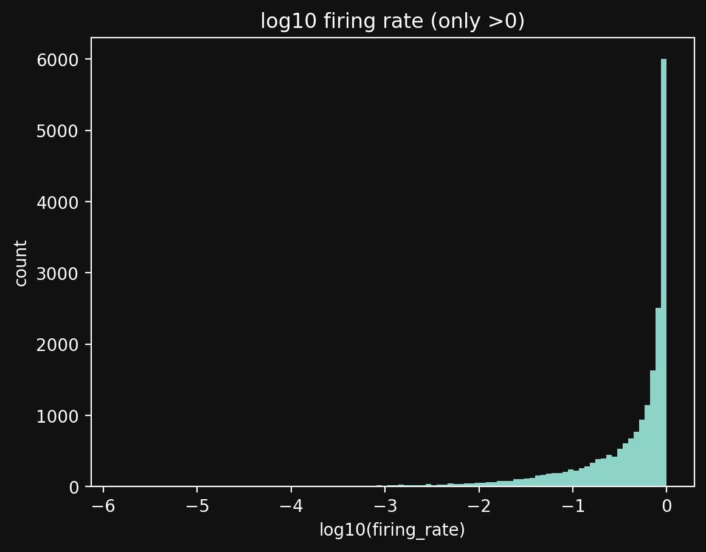
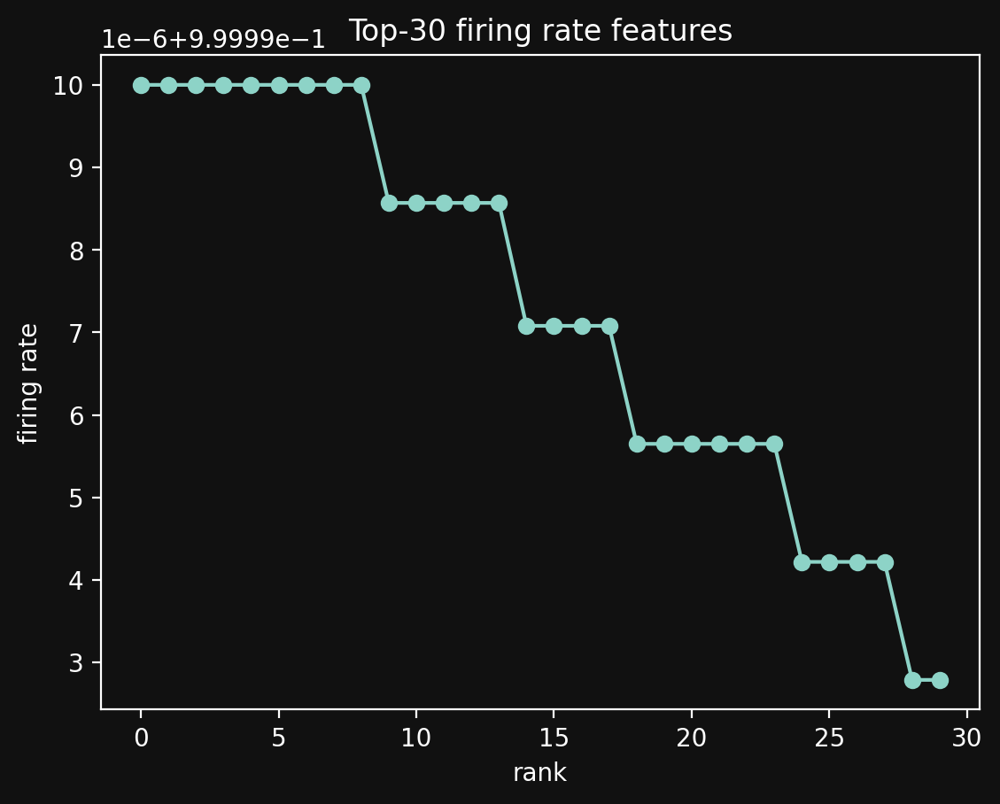
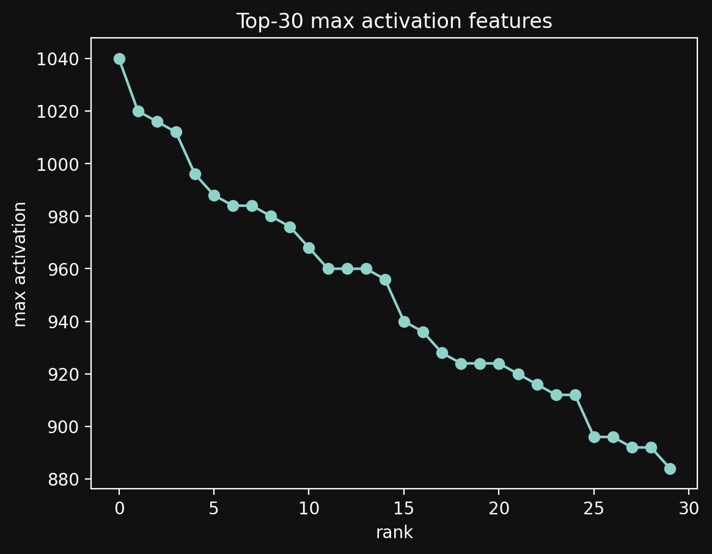
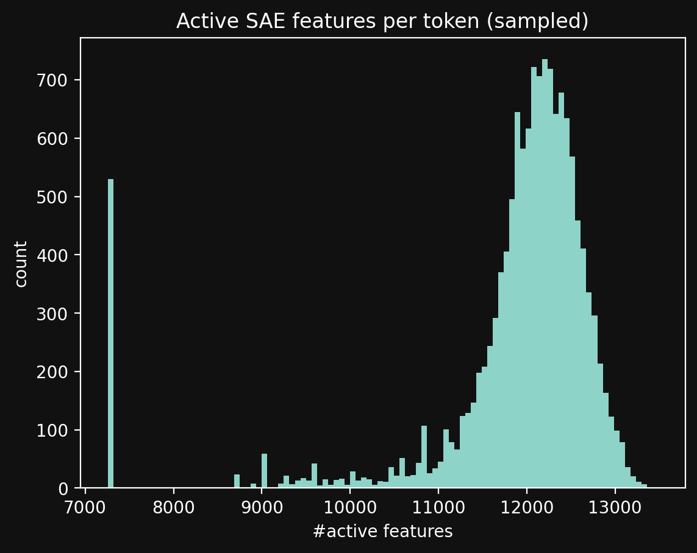
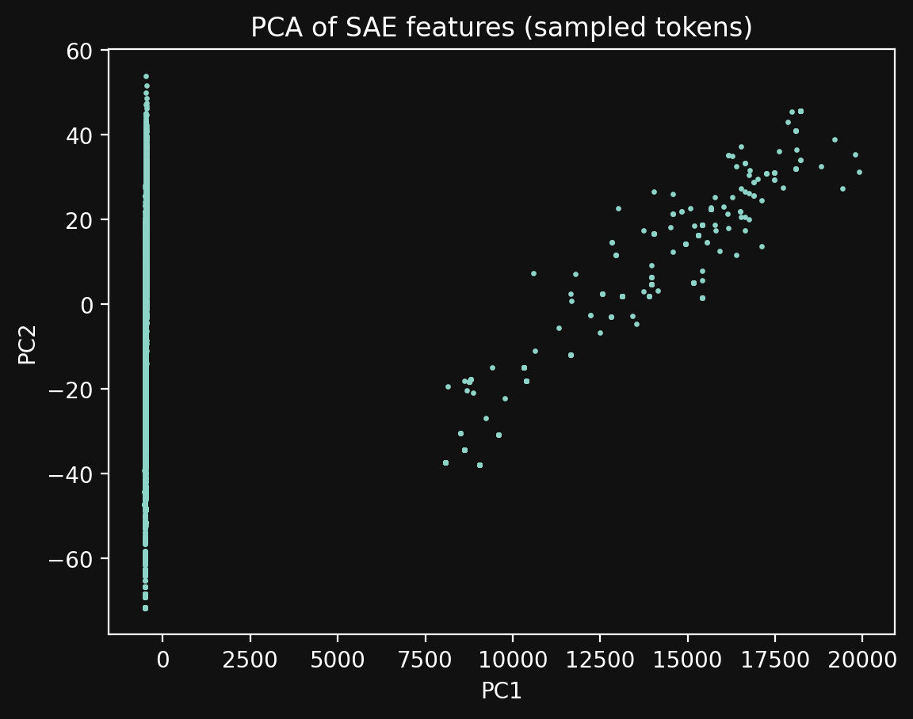

# LLM Safety Alignment через Mechanistic Interpretability

## Обзор

Проект исследует интерпретируемость LLM для задач безопасности через Sparse Autoencoder (SAE). Основная схема работы:

1. Извлечение внутренних активаций выбранного слоя LLM
2. Обучение SAE на этих активациях
3. Использование признаков SAE для обучения бинарного классификатора вредоносного контента
4. Сравнение с baseline: Dense Linear Probe на сырых активациях

SAE обучается на большом корпусе (не обязательно сбалансированном), классификатор — на сбалансированном подмножестве.

---

## Быстрый старт

### Системные требования

Минимум для инференса на GPU:
- RAM: 12 GB
- VRAM: 6 GB

### Установка

```bash
pip install torch transformers numpy pandas matplotlib scikit-learn tqdm
```

### Запуск анализа активаций

1. Убедитесь, что у вас есть папка с чанками активаций (например, `sae_feats_layer20/`)
2. Откройте ноутбук `feature_analysis.ipynb`
3. В первой ячейке настройте `DUMP_DIR` на путь к папке с активациями
4. Запустите все ячейки

---

## Генерация графиков

Графики сохраняются в папку `activation_report/` автоматически при выполнении ноутбука `feature_analysis.ipynb`.

Все графики генерируются с тёмным фоном и сохраняются с `bbox_inches="tight"` и DPI=200.

Для просмотра сохранённых изображений в ноутбуке используйте функцию `show_img()`:

```python
show_img("01_firing_rate_hist.png", width=900)
```

---

## Датасеты

### Датасеты для обучения SAE

SAE обучался на смеси следующих датасетов:

**Общие датасеты:**
- **ShareGPT** — https://huggingface.co/datasets/anon8231489123/ShareGPT_Vicuna_unfiltered
- **openwebtext-10k** — https://huggingface.co/datasets/stas/openwebtext-10k

**Специфичные для безопасности:**
- **AdvBench** — https://huggingface.co/datasets/walledai/AdvBench
- **ChatGPT-Jailbreak** — https://huggingface.co/datasets/rubend18/ChatGPT-Jailbreak-Prompts
- **hh-rlhf** — https://huggingface.co/datasets/Anthropic/hh-rlhf

**Распределение по примерам:**
- unsafe: 9899 (12.49%)
- sharegpt: 59369 (74.93%)
- openwebtext: 9887 (12.48%)
- jlbrk: 79 (0.10%)

**Распределение по токенам:**
- unsafe: 4210852 (4.21%)
- sharegpt: 86138752 (86.14%)
- openwebtext: 9613602 (9.61%)
- jlbrk: 35169 (0.04%)

### Датасет для анализа активаций

Для сбора активаций использовался датасет **Galtea Red Teaming: Non-Commercial Subset**:
- https://huggingface.co/datasets/Galtea-AI/galtea-red-teaming-clustered-data

Датасет содержит промпты с метками кластеров (семантические категории вредного поведения):
- Cluster 0: Ambiguous Requests
- Cluster 1: Jailbreak & Roleplay Attacks
- Cluster 2: Financial Stuff & Fraud
- Cluster 3: Toxicity & Hate Speech
- Cluster 4: Violence & Illegal Activities
- Cluster 5: Privacy Violations

---

## Анализ SAE-активаций

### Графики









### Статистика активаций

Анализ выполнен на подвыборке из 13676 токенов.

**Форма тензора:**
- `X.shape = [13676, 20480]` — 13676 токенов × 20480 фич

**Статистика значений:**
- `min = 0.0`
- `median = 0.234375`
- `mean = 2.2336`
- `max = 780.0`
- Перцентили: `p1=0`, `p5=0`, `p50=0.234375`, `p95=2.25`, `p99=55.5`

**Доля активных значений при разных порогах:**

| eps | frac(X > eps) | active_per_token_mean |
|-----|---------------|----------------------|
| 0.0   | 0.5793 | 11863.6 |
| 1e-4  | 0.5793 | 11863.3 |
| 1e-3  | 0.5790 | 11856.9 |
| 1e-2  | 0.5760 | 11796.2 |
| 0.1   | 0.5459 | 11180.0 |

**L0-статистика по токенам** (`L0 = (X > 0).sum(dim=1)`):
- `L0 mean = 11863.6`
- `L0 median = 12123.0`
- `L0 p95 = 12819.0`
- `L0 p99 = 13062.0`

---

## Выводы по активациям

### Главная проблема: коды не sparse

Активации SAE получились плотными, а не разреженными:
- При `eps = 0` активны ~57.9% всех элементов матрицы
- В среднем на токене активно ~11864 из 20480 фич (≈58%)
- Медиана L0 близка к среднему, p95/p99 остаются того же порядка — плотность типична, а не результат выбросов

Для SAE обычно ожидается существенно меньше активных фич на токен (порядка сотен), иначе теряется смысл разреженного разложения.

### Почему это не "просто плохой порог"

Подъём порога с `eps=0` до `eps=0.1` уменьшает активность всего с ~11864 до ~11180 фич на токен. Это означает, что активные фичи не "чуть выше нуля": большая часть значений стабильно положительная и заметная.

### Интерпретация графиков

1. **Распределение firing rate:**
   - Большой пик около 1 (много "always-on" фич) и масса около 0 (много "почти мёртвых" фич)
   - Типичная картина при коллапсе в режим "часть почти всегда on / часть почти всегда off" или при слабой sparsity-регуляризации

2. **Active features per token:**
   - Пик около ~12k активных фич на токен соответствует рассчитанной L0-статистике

3. **PCA scatter:**
   - Наличие двух режимов ("полоса" около PC1≈0 и отдельное облако) похоже на смесь распределений или доминирование offset/scale в данных

### Гипотезы о причинах

**H1 — недостаточная разреживающая регуляризация**
- Наиболее вероятно: sparsity loss слишком слабый
- Возможные причины: маленький коэффициент L1/L0, нет механизма top-k/k-sparse, нет целевого firing rate или он слишком высокий

**H2 — bias/offset делает много фич стабильно положительными**
- Если у энкодера большой положительный bias или входы имеют сильный сдвиг, многие фичи становятся "почти всегда >0"
- Согласуется с большим количеством "always-on" фич в firing rate

**H3 — несоответствие нормировок между обучением и анализом**
- Если SAE обучался на центрированных/нормированных активациях, а в анализ подаются активации другого масштаба/смещения, sparsity может деградировать

---

## Что проверить дальше

### 1. Доли "dead" и "always-on" фич

```python
fr = (X > 0).float().mean(dim=0).numpy()
print("dead (fr<0.01):", (fr < 0.01).mean())
print("always-on (fr>0.99):", (fr > 0.99).mean())
print("mid (0.01..0.99):", ((fr >= 0.01) & (fr <= 0.99)).mean())
```

### 2. PCA с центрированием

Проверить, как меняется PCA при явном центрировании данных перед разложением.

### 3. Анализ bias в энкодере

Проверить распределение bias в `sae.encoder.bias` и его влияние на firing rate.

### 4. Сравнение с активациями на обучающем датасете

Проверить, отличается ли sparsity на датасете, на котором обучался SAE, от sparsity на тестовом датасете.

---

## Структура проекта

```
security_sae/
├── feature_analysis.ipynb      # Основной ноутбук для анализа активаций
├── get_activations.py          # Скрипт для извлечения SAE-активаций из датасета
├── analyze_activations.py      # Скрипт для быстрого анализа статистики
├── dataset_viz.py             # Визуализация датасета
├── activation_report/          # Сохранённые графики анализа
│   ├── 01_firing_rate_hist.png
│   ├── 02_log10_firing_rate_hist.png
│   ├── 03_top30_firing_rate.png
│   ├── 04_top30_max_activation.png
│   ├── 05_top30_mean_when_active.png
│   ├── 06_active_features_per_token_hist.png
│   └── 07_pca_scatter.png
├── sae_feats_layer20/         # Чанки с активациями SAE
│   ├── meta.json
│   ├── sae_feats_layer20_chunk*.pt
│   └── feature_stats.npz
├── activations/               # Чекпоинты SAE
│   └── ckpt_epoch_15.pt
├── loaders/                   # Загрузчики датасетов
│   ├── main.py
│   ├── sharegpt.py
│   ├── openwebtext.py
│   ├── jailbreak.py
│   ├── advbench.py
│   ├── hh_rlhf.py
│   └── dataset_mixer.py
└── dataset/                   # Обработанные датасеты
```

---

## Использование скриптов

### Извлечение активаций

```bash
python get_activations.py
```

Скрипт читает датасет из CSV, извлекает активации слоя LLM, пропускает их через SAE и сохраняет в чанки.

### Быстрый анализ статистики

```bash
python analyze_activations.py --dump_dir ./sae_feats_layer20 --sample_tokens 20000
```

Скрипт вычисляет статистику по всем токенам и сохраняет в `feature_stats.npz`, а также выводит краткий отчёт по sparsity на подвыборке.
